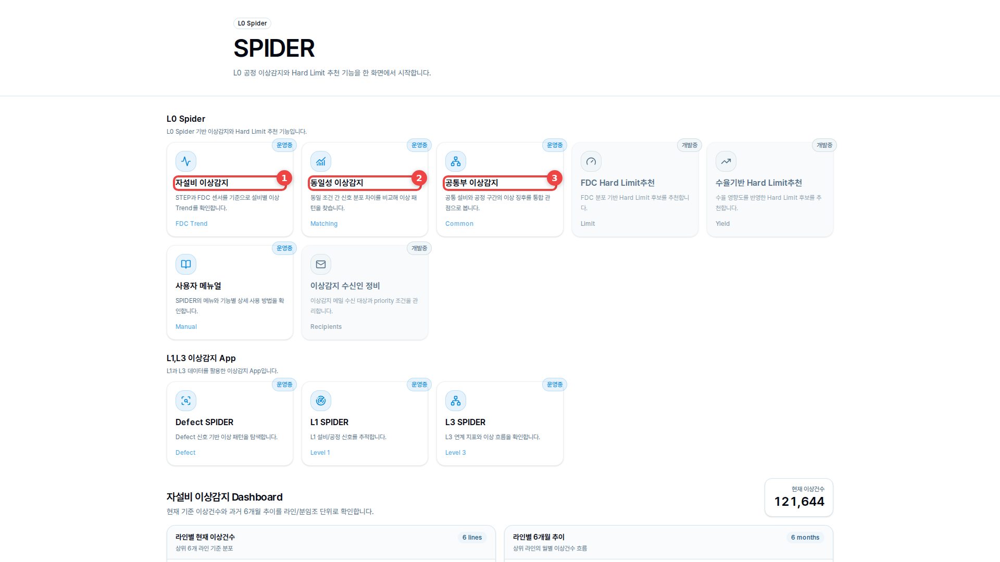
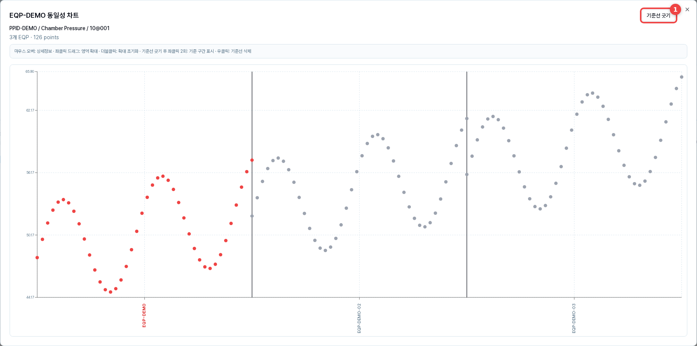
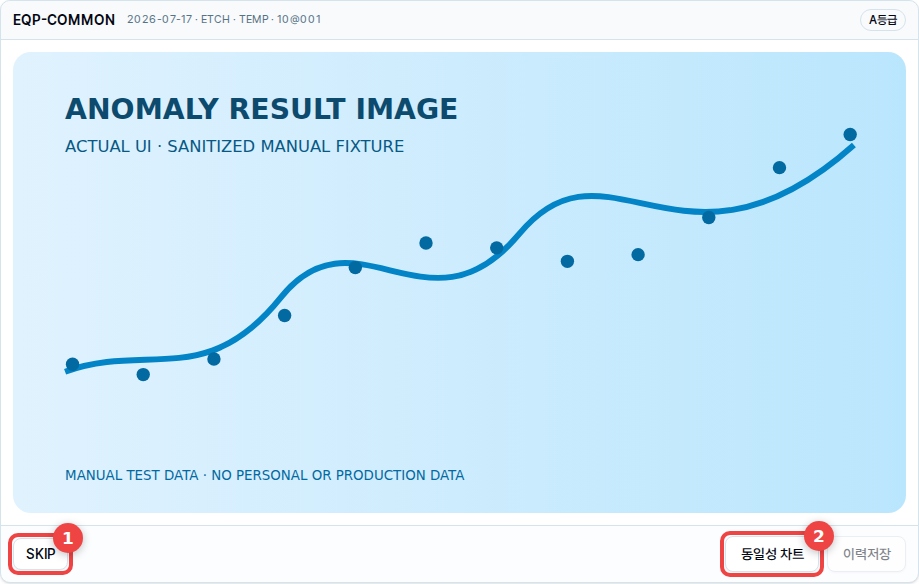
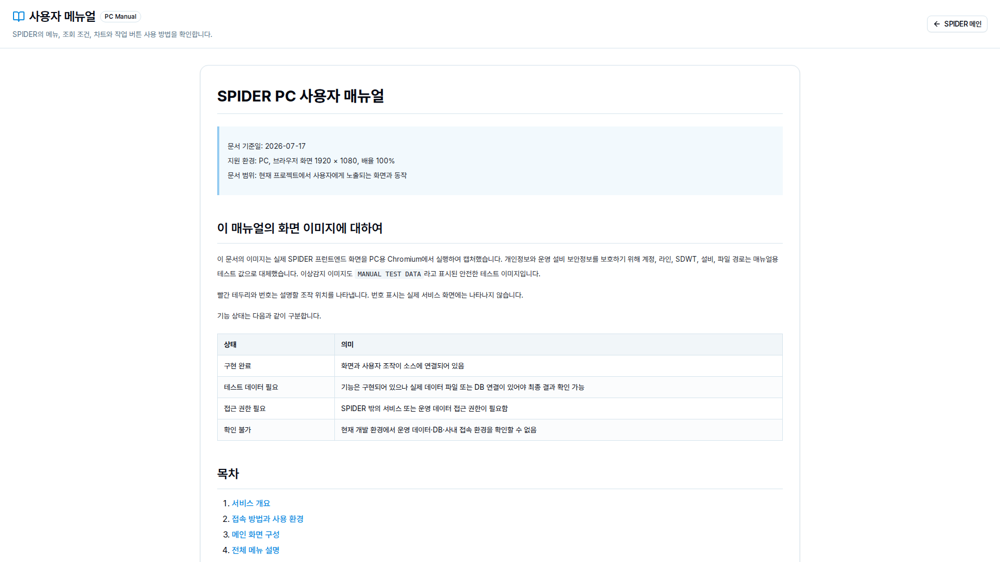

# SPIDER PC 사용자 매뉴얼

> 문서 기준일: 2026-07-17  
> 지원 환경: PC, 브라우저 화면 1920 × 1080, 배율 100%  
> 문서 범위: 현재 프로젝트에서 사용자에게 노출되는 화면과 동작

## 이 매뉴얼의 화면 이미지에 대하여

이 문서의 이미지는 실제 SPIDER 프런트엔드 화면을 PC용 Chromium에서 실행하여 캡처했습니다. 개인정보와 운영 설비 보안정보를 보호하기 위해 계정, 라인, SDWT, 설비, 파일 경로는 매뉴얼용 테스트 값으로 대체했습니다. 이상감지 이미지도 `MANUAL TEST DATA`라고 표시된 안전한 테스트 이미지입니다.

빨간 테두리와 번호는 설명할 조작 위치를 나타냅니다. 번호 표시는 실제 서비스 화면에는 나타나지 않습니다.

기능 상태는 다음과 같이 구분합니다.

| 상태 | 의미 |
| --- | --- |
| 구현 완료 | 화면과 사용자 조작이 소스에 연결되어 있음 |
| 테스트 데이터 필요 | 기능은 구현되어 있으나 실제 데이터 파일 또는 DB 연결이 있어야 최종 결과 확인 가능 |
| 접근 권한 필요 | SPIDER 밖의 서비스 또는 운영 데이터 접근 권한이 필요함 |
| 확인 불가 | 현재 개발 환경에서 운영 데이터·DB·사내 접속 환경을 확인할 수 없음 |

## 목차

1. [서비스 개요](#1-서비스-개요)
2. [접속 방법과 사용 환경](#2-접속-방법과-사용-환경)
3. [메인 화면 구성](#3-메인-화면-구성)
4. [전체 메뉴 설명](#4-전체-메뉴-설명)
5. [자설비 이상감지](#5-자설비-이상감지)
6. [동일성 이상감지](#6-동일성-이상감지)
7. [공통부 이상감지](#7-공통부-이상감지)
8. [사용자 매뉴얼 화면과 외부 SPIDER](#8-사용자-매뉴얼-화면과-외부-spider)
9. [검색·필터와 결과 확인 공통 방법](#9-검색필터와-결과-확인-공통-방법)
10. [데이터 등록·수정·삭제](#10-데이터-등록수정삭제)
11. [오류 메시지와 해결 방법](#11-오류-메시지와-해결-방법)
12. [자주 묻는 질문](#12-자주-묻는-질문)
13. [사용자 주의사항](#13-사용자-주의사항)

## 1. 서비스 개요

SPIDER는 L0 공정의 이상감지 기능을 한 메인 화면에서 시작하는 PC용 웹서비스입니다. 자설비·동일성·공통부 이상감지 결과를 조건별로 확인하고, 필요한 결과를 SKIP하거나 이력으로 저장할 수 있습니다.

서비스의 일부 화면은 운영 파일과 데이터베이스에 의존합니다. 화면이 열리더라도 권한, 기준 파일 또는 당일 데이터가 없으면 선택 항목이나 결과가 비어 있을 수 있습니다.

## 2. 접속 방법과 사용 환경

### 권장 환경

| 항목 | 기준 |
| --- | --- |
| 기기 | PC 또는 노트북 |
| 화면 | 1920 × 1080 권장 |
| 브라우저 배율 | 100% |
| 모바일 | 지원 대상 아님 |
| 네트워크 | 서비스와 데이터 서버에 접근 가능한 사내 네트워크 |

### 접속 절차

1. 회사에서 안내받은 SPIDER 배포 URL을 PC 브라우저 주소창에 입력합니다.
2. 메인 화면 상단에 `SPIDER` 제목과 기능 카드가 표시되는지 확인합니다.
3. 원하는 기능 카드를 클릭합니다.
4. 기능 화면에서 오른쪽 위의 **SPIDER 메인**을 클릭하면 메인 화면으로 돌아갑니다.

현재 소스에는 별도의 로그인·로그아웃 화면이 없습니다. 자설비와 공통부 이상감지 화면은 접속 정보를 이용해 현재 사용자를 식별하고 인사말을 표시합니다. 사용자 이름이 보이지 않거나 `접속자 정보를 확인할 수 없습니다.`가 나오면 브라우저 로그인 문제가 아니라 접속 IP 또는 사용자 조회 환경을 관리자에게 확인해야 합니다.

> 배포 URL과 사내 접속 절차는 프로젝트 안에서 확인할 수 없어 운영 담당자의 안내가 필요합니다.

## 3. 메인 화면 구성

메인 화면에는 서비스 제목, L0 기능 카드, 외부 SPIDER 카드, 자설비 이상감지 대시보드가 위에서 아래 순서로 배치됩니다.

화면을 아래로 스크롤하면 라인별 현재 이상건수와 최근 6개월 추이 영역을 볼 수 있습니다. 현재 개발 소스의 대시보드 숫자와 차트는 예시 데이터이므로 운영 현황 수치로 사용하지 마십시오.

### 메뉴 선택

1. **L0 Spider 기능 카드**: 자설비, 동일성, 공통부 이상감지와 사용자 매뉴얼로 이동합니다.
2. **L1·L3 이상감지 App 카드**: Defect, L1, L3 별도 서비스로 이동합니다. 새 서비스의 권한과 네트워크가 별도로 필요할 수 있습니다.
3. 카드 오른쪽 위의 `운영중` 표시로 현재 매뉴얼에서 안내하는 제공 기능을 확인합니다.

## 4. 전체 메뉴 설명

| 메뉴 | 목적 | 현재 상태 | 주요 입력·동작 |
| --- | --- | --- | --- |
| 자설비 이상감지 | 설비별 FDC 이상 추이를 산점도로 확인 | 구현 완료, 테스트 데이터 필요 | Line, SDWT, Grade, STEP, eqp_ch, sensor, ch_step, SKIP |
| 동일성 이상감지 | 동일 조건의 설비 결과 이미지를 비교 | 구현 완료, 테스트 데이터 필요 | Line, SDWT, Sensor, ch_step |
| 공통부 이상감지 | 공통 설비 결과 이미지를 설비·센서별 확인 | 구현 완료, 테스트 데이터 필요 | Line, SDWT, prc_group, eqp, sensor, SKIP |
| 사용자 메뉴얼 | SPIDER의 상세 PC 사용 방법 확인 | 구현 완료 | 목차 링크, 화면 이미지, 기능별 절차 |
| Defect SPIDER | Defect 신호 기반 이상 패턴 확인 | 접근 권한 필요 | 외부 서비스에서 확인 |
| L1 SPIDER | L1 설비·공정 신호 확인 | 접근 권한 필요 | 외부 서비스에서 확인 |
| L3 SPIDER | L3 연계 지표와 이상 흐름 확인 | 접근 권한 필요 | 외부 서비스에서 확인 |

관리자 전용 메뉴나 화면상의 역할 구분은 현재 소스에서 확인되지 않았습니다. 데이터 서버와 DB 권한은 별도로 적용될 수 있습니다.

## 5. 자설비 이상감지

자설비 이상감지는 선택한 설비와 센서의 시간별 이상 추이를 산점도로 확인하는 화면입니다. 필터를 왼쪽에서 오른쪽 순서로 선택하면 마지막 `ch_step` 선택 후 차트가 그려집니다.

### 5.1 조회 조건 선택

#### 사용 절차

1. **Line Name**에서 라인을 선택합니다.
2. **SDWT**에서 분임조를 선택합니다. SKIP한 결과만 확인하려면 `SKIP LIST`를 선택합니다.
3. **Sensor Grade**에서 등급을 선택합니다. `A/B`는 하나의 선택 항목이며 D, N, M을 추가로 선택할 수 있습니다.
4. **STEP**을 선택합니다.
5. **eqp_ch**에서 설비 채널을 선택합니다. `ALL`은 현재 조건의 모든 설비 채널을 대상으로 합니다.
6. **sensor**를 선택합니다. `ALL`이 보이면 모든 센서를 대상으로 할 수 있습니다.
7. **ch_step**을 선택합니다. `ALL`이 보이면 현재 조건의 모든 ch_step을 대상으로 합니다.
8. 마지막 조건을 선택하면 아래 **Scatter chart** 영역이 갱신됩니다.

1. **Sensor Grade**: 이상 등급을 선택합니다.
2. **ch_step**: 차트 조회를 완료하는 마지막 필터입니다.

#### 입력 항목 설명

| 항목 | 필수 여부 | 설명 | 예시 |
| --- | --- | --- | --- |
| Line Name | 필수 | 조회할 라인 | `LINE-01` |
| SDWT | 필수 | 조회할 분임조 또는 `SKIP LIST` | `DEMO_SDWT` |
| Sensor Grade | 필수 | 표시할 이상 등급. 복수 선택 가능 | `A/B`, `D` |
| STEP | 필수 | 공정 단계 | `MAIN ETCH` |
| eqp_ch | 필수 | 설비 채널. `ALL` 제공 가능 | `EQP-DEMO` |
| sensor | 필수 | FDC 센서 | `Chamber Pressure` |
| ch_step | 필수 | 센서 채널 단계. `ALL` 제공 가능 | `10` |

각 조건 위의 검색창에 일부 글자를 입력하면 긴 목록에서 항목을 좁힐 수 있습니다. 별도의 **조회** 또는 **초기화** 버튼은 없습니다. 앞 단계 조건을 바꾸면 뒤 단계 선택과 결과가 다시 계산됩니다.

### 5.2 산점도 확인

1. **Scatter chart**: 필터 선택 결과가 설비별 카드로 표시됩니다.
2. **범례와 점**: 빨간 점은 이상감지 데이터, 회색 점은 이전 데이터입니다. 녹색 세로 점선은 변경점 이력입니다.

차트의 가로축은 `act_time`, 세로축은 선택한 `sensor_ch_step` 값입니다. 카드 상단에서 EQP, PPID, 센서, 데이터 개수, 등급을 확인할 수 있습니다.

- 점 위에 마우스를 올리면 시간, 측정값, Lot·Wafer 정보를 확인할 수 있습니다.
- 차트 안에서 마우스로 영역을 끌면 해당 범위를 확대합니다.
- 차트를 두 번 클릭하면 확대 상태가 초기화됩니다.
- 데이터가 많으면 아래로 스크롤해 다른 EQP 카드를 확인합니다.
- 선택 조건과 일치하는 파일이 없으면 빈 결과 안내가 표시됩니다.
- 유효한 산점도 값이 없으면 사용한 데이터 파일 경로와 함께 안내가 표시될 수 있습니다.

### 5.3 차트별 작업 버튼

1. **SKIP**: 현재 차트 한 건을 SKIP 등록합니다.
2. **EQP ALL SKIP**: 같은 EQP의 실제 모든 ch_step을 각각 별도 행으로 일괄 등록합니다.
3. **동일성 차트**: 동일 조건의 설비 데이터를 한 차트에서 비교합니다.

오른쪽의 **변경점이력**은 차트의 변경점 목록을 열고, **이력저장**은 현재 결과를 이력 DB에 저장합니다. 별도의 과거 이력 조회 App은 제공하지 않으며, 저장 동작은 운영 DB와 관련 파일이 연결된 환경에서 최종 확인해야 합니다.

### 5.4 SKIP 등록과 해제

SKIP은 이미 검토한 이상감지 결과를 일정 기간 일반 결과에서 제외할 때 사용합니다. 등록 시점부터 3일(72시간) 동안 UI에서 활성 상태로 취급하며, 기간이 지나면 일반 결과에 다시 나타날 수 있습니다. 과거 SKIP 이력 데이터는 자동 삭제하지 않습니다.

1. 필요하면 SKIP 사유를 한 줄로 입력합니다. 입력하지 않아도 됩니다.
2. **OK**를 누르면 등록합니다. 취소하려면 **취소** 또는 오른쪽 위 닫기를 누릅니다.

`EQP ALL SKIP`도 같은 확인 절차를 사용하지만, 현재 EQP의 실제 ch_step마다 한 행씩 저장합니다. 처리 결과 메시지에서 등록 건수를 확인하십시오.

SKIP한 결과를 직접 해제하려면 SDWT의 `SKIP LIST`를 선택하고 해당 카드의 **SKIP해제**를 누릅니다. 해제는 운영 DB 변경이므로 잘못 누르지 않도록 대상 EQP와 센서를 먼저 확인하십시오.

### 5.5 동일성 차트

1. **기준선 긋기**: 차트에서 선택한 위치에 기준선을 표시합니다. 화면 안내에 따라 다시 누르거나 우클릭하여 기준선을 제거합니다.

설비 그룹은 세로 구분선과 아래의 EQP 이름으로 나뉩니다. 빨간 점은 현재 선택 EQP, 회색 점은 비교 EQP입니다. 점에 마우스를 올려 상세 정보를 확인하고, 드래그 확대와 더블클릭 초기화를 사용할 수 있습니다.

## 6. 동일성 이상감지

동일성 이상감지는 최신 동일성 분석 결과 이미지를 Line, SDWT, Sensor, ch_step 기준으로 확인하는 화면입니다. 자설비 산점도와 달리 분석 완료 이미지가 카드로 표시됩니다.

### 사용 절차

1. **Line Name**을 선택합니다.
2. **SDWT**를 선택합니다.
3. **Sensor**를 선택합니다.
4. **ch_step**에서 하나 또는 `ALL`을 선택합니다.
5. 아래에서 동일성 최신 날짜와 STEP별 이미지 카드를 확인합니다.

1. **Sensor**: 비교할 센서를 선택합니다.
2. **ch_step**: 이미지 조회를 완료하는 마지막 조건입니다.

#### 결과 설명

- `동일성 최신날짜`는 현재 사용 중인 동일성 결과의 기준 시각입니다.
- 카드 제목에서 센서와 ch_step, 등급, STEP·PPID 정보를 확인합니다.
- `ALL`을 선택하면 가능한 모든 ch_step 이미지가 STEP 그룹별로 나옵니다.
- 이미지 파일을 불러오지 못하면 `이미지를 불러오지 못했습니다.`가 표시됩니다.
- 선택 조건에 결과가 없으면 `선택 조건에 해당하는 img.png가 없습니다.`가 표시됩니다.

이 화면에는 SKIP, 등록·수정·삭제, 다운로드 버튼이 없습니다.

## 7. 공통부 이상감지

공통부 이상감지는 Line, SDWT, 공정 그룹, 설비, 센서를 기준으로 공통부 이상감지 이미지를 확인합니다. 마지막 sensor를 선택하면 결과 이미지가 EQP별 2열 형태로 표시됩니다.

### 7.1 조회 조건 선택

#### 사용 절차

1. **Line Name**을 선택합니다.
2. **SDWT**를 선택합니다. SKIP 결과만 볼 때는 `SKIP LIST`를 선택합니다.
3. **prc_group**을 선택합니다.
4. **eqp**를 선택합니다. `ALL`은 현재 조건의 모든 EQP를 대상으로 합니다.
5. **sensor**를 선택합니다.
6. 아래에서 EQP별 이상감지 이미지와 등급·날짜·step 정보를 확인합니다.

1. **prc_group**: 공정 그룹을 선택합니다.
2. **eqp**: 특정 EQP 또는 `ALL`을 선택합니다.
3. **sensor**: 이미지 조회를 완료하는 마지막 필터입니다.

#### 입력 항목 설명

| 항목 | 필수 여부 | 설명 | 예시 |
| --- | --- | --- | --- |
| Line Name | 필수 | 조회 라인 | `LINE-01` |
| SDWT | 필수 | 분임조 또는 `SKIP LIST` | `DEMO_SDWT` |
| prc_group | 필수 | 공정 그룹 | `ETCH` |
| eqp | 필수 | EQP 또는 `ALL` | `EQP-COMMON` |
| sensor | 필수 | 공통부 센서 | `TEMP` |

### 7.2 이미지와 버튼 확인

1. **SKIP**: 현재 공통부 이상감지 한 건을 등록합니다. 자설비와 같은 선택적 comment·OK 절차를 사용합니다.
2. **동일성 차트**: 이 이미지에 사용된 공통부 데이터 파일을 이용해 설비 비교 차트를 엽니다.

카드 제목에서 EQP, 날짜, 공정 그룹, sensor, ch_step과 등급을 확인합니다. **이력저장**은 현재 화면에서 비활성화되어 있어 사용할 수 없습니다. 공통부에는 `EQP ALL SKIP` 버튼이 없습니다.

공통부 SKIP도 등록 후 3일 동안 UI의 `SKIP LIST`에 반영되며, 3일이 지나면 활성 SKIP 효과만 종료됩니다. SKIP LIST에서 **SKIP해제**를 눌러 직접 해제할 수도 있습니다.

#### 결과가 없을 때

- `표시할 file_path 데이터가 없습니다.`: 선택 조건과 일치하는 인덱스 행이 없습니다.
- `공통부 이상감지 이미지를 불러오지 못했습니다.`: 결과 행은 있지만 이미지 파일을 읽을 수 없습니다.
- `PASS 이력을 불러오지 못했습니다`: SKIP 상태 조회 DB에 접근하지 못했습니다.

## 8. 사용자 매뉴얼 화면과 외부 SPIDER

### 사용자 매뉴얼 화면

메인 화면에서 **사용자 메뉴얼** 카드를 클릭하면 현재 읽고 있는 이 PC 사용자 매뉴얼이 앱 안에 표시됩니다. 화면 오른쪽 위의 **SPIDER 메인**으로 돌아갈 수 있고, 목차 링크를 누르면 원하는 기능 설명으로 바로 이동합니다.

### Defect·L1·L3 SPIDER

메인 화면의 Defect SPIDER, L1 SPIDER, L3 SPIDER 카드는 별도 외부 주소로 이동합니다. 해당 서비스의 화면과 기능은 이 저장소에서 직접 확인할 수 없어 본 매뉴얼의 기능별 절차에서 제외했습니다. 접근되지 않으면 팝업 차단, 사내 네트워크, 서비스별 권한을 확인하십시오.

## 9. 검색·필터와 결과 확인 공통 방법

### 필터 사용 원칙

1. 필터는 항상 왼쪽에서 오른쪽 순서로 선택합니다.
2. 앞 조건을 바꾸면 뒤쪽 선택지가 초기화되거나 다시 계산됩니다.
3. 각 필터의 검색창에는 목록을 찾기 위한 일부 문자열만 입력해도 됩니다.
4. 항목 오른쪽의 `건`, `eqp`, `images` 표시는 현재 조건의 결과 개수입니다.
5. `ALL`은 현재까지 선택한 조건에서 사용 가능한 전체 대상을 의미합니다.
6. 별도 초기화 버튼이 없으므로 첫 필터를 다시 선택하거나 페이지를 새로고침하여 처음부터 선택합니다.

### 결과 확인 원칙

- 등급, EQP, 센서, ch_step이 의도한 대상인지 카드 제목에서 다시 확인합니다.
- 차트 점의 색은 반드시 화면 범례와 함께 해석합니다.
- 이미지 결과는 생성 기준 날짜 또는 최신 날짜를 확인합니다.
- 결과가 없을 때는 앞 단계 필터에 항목 개수가 있었는지 역순으로 확인합니다.
- 현재 화면에는 사용자가 직접 누르는 테이블 정렬이나 페이지 이동 기능이 없습니다.

## 10. 데이터 등록·수정·삭제

현재 사용자가 수행할 수 있거나 화면에 보이는 데이터 변경 작업은 다음과 같습니다.

| 작업 | 화면 | 실제 동작 상태 | 주의사항 |
| --- | --- | --- | --- |
| 차트 한 건 SKIP | 자설비·공통부 | 운영 DB 연결 시 저장 | comment는 선택 입력 |
| EQP ALL SKIP | 자설비 | EQP의 모든 실제 ch_step을 각각 저장 | 최대 대상 수와 DB 오류 메시지 확인 |
| SKIP해제 | 자설비·공통부의 SKIP LIST | 운영 DB 연결 시 삭제 요청 | 과거 이력 보존 정책은 관리자 확인 필요 |
| 이력저장 | 자설비 | DB·파일 연결 시 저장 | 개발 환경에서 최종 확인 불가 |

SKIP의 3일 만료는 과거 SKIP 이력 데이터 삭제가 아니라, 등록 시각 기준 72시간이 지난 건을 활성 SKIP 목록에서 제외하는 UI 효과입니다.

## 11. 오류 메시지와 해결 방법

| 화면 메시지 또는 증상 | 의미 | 해결 방법 |
| --- | --- | --- |
| 선택 가능한 Line이 없습니다. | 라인 매핑을 읽지 못했거나 권한이 없음 | 사내 네트워크와 매핑 파일 접근 권한 확인 |
| 선택 조건에 해당하는 STEP/sensor/ch_step이 없습니다. | 앞 단계 조건에 실제 데이터가 없음 | 앞 필터를 바꾸고 각 항목의 건수 확인 |
| 표시할 file_path 데이터가 없습니다. | 조건과 일치하는 이상감지 인덱스가 없음 | Line·SDWT·등급·날짜 조건 확인 |
| `{EQP}에 해당하는 유효한 scatter 데이터가 없습니다.` | 데이터 파일은 찾았으나 시간 또는 센서 값이 유효하지 않음 | 함께 표시되는 파일 경로를 운영 담당자에게 전달 |
| 이미지를 불러오지 못했습니다. | 결과 이미지 파일을 읽지 못함 | 파일 생성 여부, 경로, 읽기 권한 확인 |
| PASS 이력을 불러오지 못했습니다. | SKIP DB 조회 실패 | DB 연결 또는 사용자 권한 확인 후 새로고침 |
| 클릭이력 저장 실패 | 화면 조회는 됐으나 클릭이력 DB 저장 실패 | 결과 확인을 계속할 수 있으나 관리자에게 메시지 전달 |
| 접속자 정보를 확인할 수 없습니다. | SSO 세션 만료 또는 사용자 claim 확인 실패 | 새로고침하여 SSO에 다시 로그인하고 반복되면 인증 설정 확인 |
| 빈 화면 또는 계속 로딩 중 | API 또는 데이터 서버 응답 지연 | 한 번 새로고침하고 반복되면 URL·시간·선택 조건을 기록해 문의 |

오류를 문의할 때는 실제 계정·설비 보안정보를 캡처에 포함하지 말고, 메뉴 이름, 발생 시각, 선택 조건, 화면 메시지, 표시된 데이터 경로를 마스킹하여 전달하십시오.

## 12. 자주 묻는 질문

### Q. 로그인 또는 로그아웃 버튼은 어디에 있나요?

SPIDER에 접속하면 SSO 로그인 화면으로 자동 이동합니다. 인증 후 SSO의 사용자명과 Knox ID가 화면에 표시됩니다. 현재 UI에는 별도 로그아웃 버튼이 없으므로 공용 PC에서는 브라우저와 사내 SSO 세션을 함께 종료하십시오.

### Q. 필터를 모두 골랐는데 조회 버튼이 없습니다.

자설비·동일성·공통부 이상감지는 마지막 필터를 선택하는 즉시 결과를 갱신합니다.

### Q. `ALL`을 고르면 무엇이 달라지나요?

현재까지 선택한 조건에 속하는 모든 EQP, 센서 또는 ch_step을 대상으로 결과를 만듭니다. 결과가 많아질 수 있으므로 로딩이 끝날 때까지 기다리고 아래로 스크롤해 모든 카드를 확인하십시오.

### Q. SKIP과 EQP ALL SKIP의 차이는 무엇인가요?

SKIP은 현재 차트 한 건만 등록합니다. EQP ALL SKIP은 같은 EQP에서 실제로 조회되는 모든 ch_step을 각각 별도 행으로 등록하며 자설비 이상감지에서만 제공합니다.

### Q. SKIP은 언제 자동으로 풀리나요?

등록 시각으로부터 72시간 동안 활성 상태입니다. 그 이후에는 UI의 활성 SKIP 대상에서 빠지지만 과거 SKIP 이력 데이터는 자동 삭제하지 않습니다.

### Q. 차트가 너무 좁게 보입니다.

브라우저 배율을 100%로 맞추고 1920 × 1080 화면에서 사용하십시오. 모바일 레이아웃은 지원하지 않습니다.

## 13. 사용자 주의사항

- 모바일과 태블릿 화면은 지원 대상이 아닙니다.
- 테스트 또는 매뉴얼 화면에 실제 계정, 이메일, Lot, 설비 경로를 입력하거나 공유하지 마십시오.
- SKIP·SKIP해제·이력저장은 운영 데이터에 영향을 줄 수 있으므로 대상 Line, EQP, sensor, ch_step을 다시 확인하십시오.
- `ALL`은 여러 건을 한 번에 처리할 수 있습니다. 특히 EQP ALL SKIP은 실제 ch_step별 여러 행을 저장합니다.
- 대시보드의 예시 데이터는 운영 판단에 사용하지 마십시오.
- 파일 경로가 오류 화면에 나타나면 사내 보안 기준에 맞게 마스킹한 뒤 공유하십시오.

---

문서 내용과 실제 운영 화면이 다르면 화면 메뉴명, 발생 시각, 브라우저 버전과 함께 운영 담당자에게 알려주십시오.
