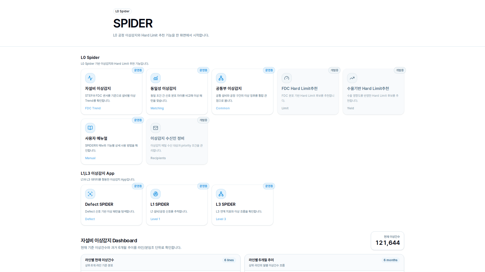
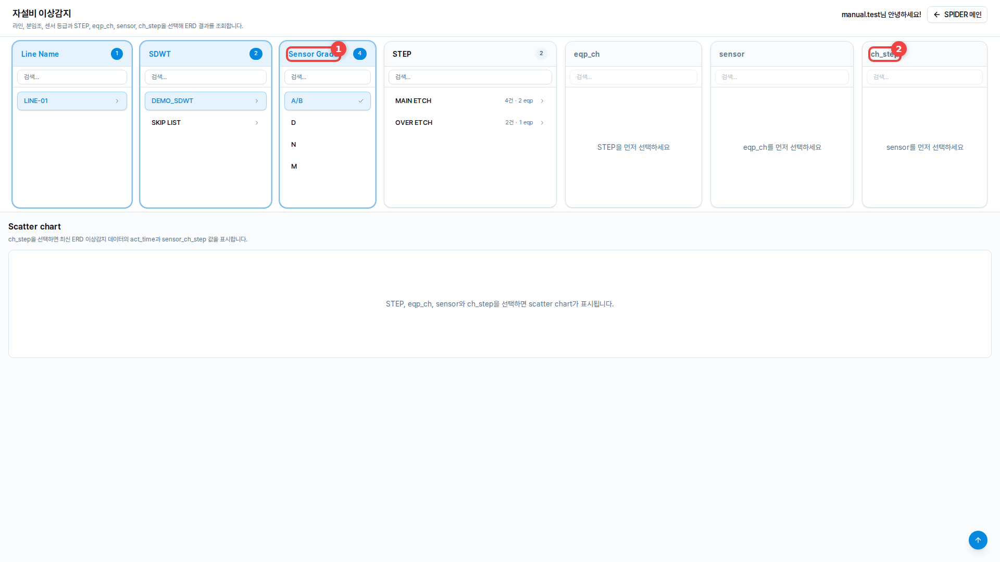
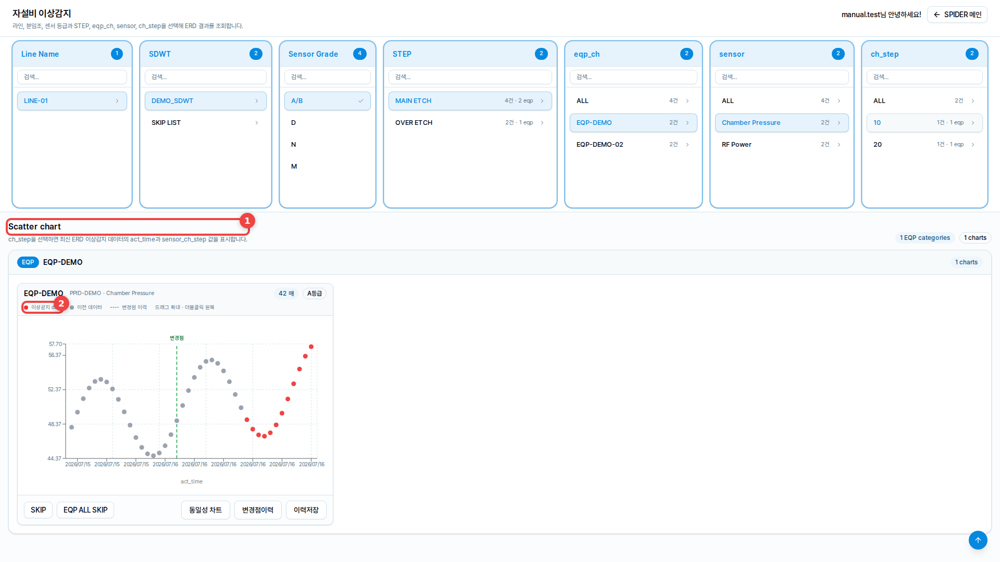
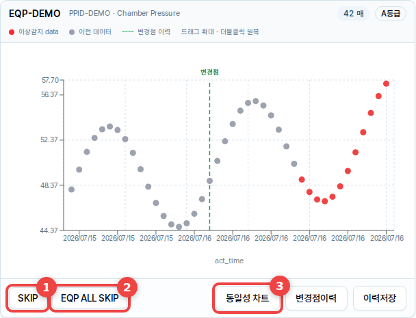
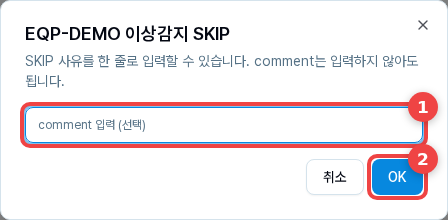
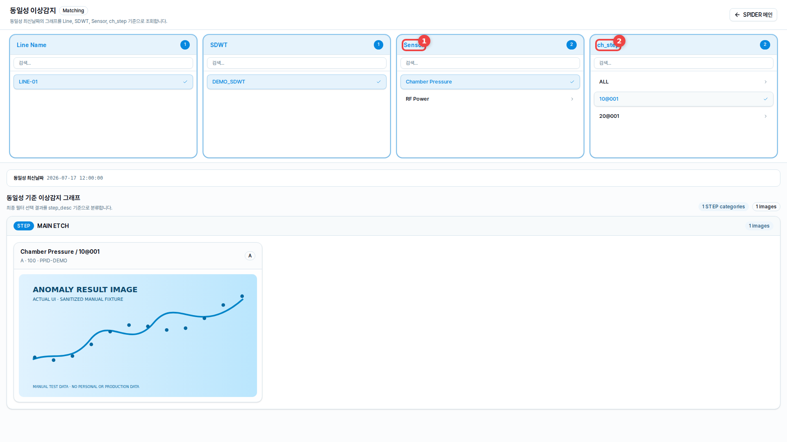
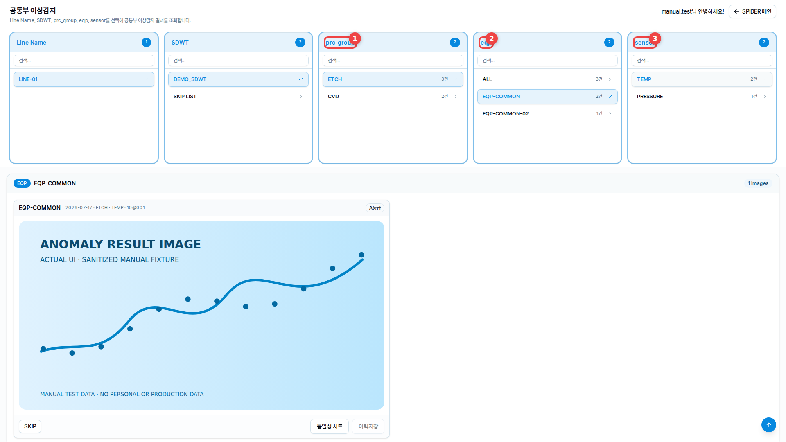

# SPIDER 사용자 매뉴얼

> 기준일: 2026-07-21 
> 권장 환경: 사내 네트워크에 연결된 PC, 1920 × 1080, 브라우저 배율 100%

## 목차

1. [서비스 개요와 접속](#1-서비스-개요와-접속)
2. [메인 화면과 라인별 대시보드](#2-메인-화면과-라인별-대시보드)
3. [필터 공통 사용법](#3-필터-공통-사용법)
4. [자설비 이상감지](#4-자설비-이상감지)
5. [Mailing Report 및 My EQP 등록](#5-mailing-report-및-my-eqp-등록)
6. [동일성·공통부 이상감지](#6-동일성공통부-이상감지)
7. [Mailing Report 메일 확인](#7-mailing-report-메일-확인)
8. [데이터 변경 작업](#8-데이터-변경-작업)
9. [문제 해결과 주의사항](#9-문제-해결과-주의사항)

## 1. 서비스 개요와 접속

SPIDER는 L0 공정의 이상감지 결과를 조회하고 개인 모니터링 설비와 Mailing 수신 조건을 관리하는 PC용 웹서비스입니다.

회사에서 안내받은 URL로 접속한 뒤 원하는 기능 카드를 선택합니다. 각 기능 화면 오른쪽 위의 **SPIDER 메인**을 누르면 메인 화면으로 돌아갑니다.

별도 로그인 화면은 없습니다. 접속 IP를 이용해 사용자의 `knox_id`를 확인하므로 사용자명이 보이지 않으면 사내 네트워크, 프록시 또는 사용자 조회 설정을 관리자에게 확인하십시오.

### 주요 메뉴

| 메뉴 | 용도 |
| --- | --- |
| 자설비 이상감지 | 설비·센서별 FDC 이상 추이와 차트 확인 |
| Mailing Report 및 My EQP 등록 | 메일 수신 조건과 모니터링 설비·열람자 등록 |
| 동일성 이상감지 | 동일 조건의 분석 완료 이미지 비교 |
| 공통부 이상감지 | 공통부 이상 이미지와 설비 비교 차트 확인 |
| 사용자 메뉴얼 | 현재 문서 확인 |
| Hard Limit·Defect·L1·L3 SPIDER | 별도 서비스로 이동 |

## 2. 메인 화면과 라인별 대시보드

메인 화면 위쪽에는 기능 카드, 아래쪽에는 **라인별 이상 현황 Dashboard**가 표시됩니다.

### 대시보드 사용법

1. **라인 선택**에서 전체 또는 복수 Line을 선택합니다.
2. **조회**를 누릅니다. **초기화**를 누르면 전체 Line과 기본 추이 기간으로 돌아갑니다.
3. 상단 7개 지표를 확인합니다.

| 지표 | 의미 |
| --- | --- |
| 모니터링 센서 총합 | 최신 시각의 TL total 합계 |
| 전체 이상 건수 | 선택 기간의 전체 고유 이상건수 |
| A/B, D, N, M Grade | 등급별 고유 이상건수 |
| 전일 대비 | 전일 동일 시각과 비교한 증감 |

아래의 **라인별 이상 건수**, **일자별 이상 추이**, **라인별 상세 현황**에서 Line별 분포를 확인할 수 있습니다. 추이는 `10일`, `30일`, `90일`, `180일`로 바꿀 수 있으며, 상세 현황의 **상세** 버튼은 해당 Line의 자설비 이상감지로 이동합니다.

## 3. 필터 공통 사용법

- 필터는 왼쪽에서 오른쪽 순서로 선택합니다.
- 앞 조건을 변경하면 뒤 조건과 결과가 다시 계산됩니다.
- 검색창에는 항목명의 일부만 입력해도 됩니다.
- `ALL`은 현재 조건에서 조회 가능한 전체 대상을 의미합니다.
- 필터 항목을 선택해도 해당 목록의 스크롤 위치는 유지됩니다.
- 마지막 필터를 선택하면 별도 조회 버튼 없이 결과가 갱신됩니다.
- 목록이 길면 필터 영역 아래 경계를 드래그해 높이를 조절할 수 있습니다.

## 4. 자설비 이상감지

자설비 이상감지는 최신 ERD 데이터를 산점도로 확인하는 화면입니다.

필터 위의 **3일치 동일성 차트 같이 보기** 토글은 기본 `ON`입니다. 필요하면 조회 전후 언제든 `OFF`로 변경할 수 있습니다.

### 4.1 조회 순서

1. **Line Name**
2. **SDWT** (`MY EQP`, `SKIP LIST` 포함)
3. **Sensor Grade** (복수 선택 가능)
4. **STEP**
5. **eqp_ch** (`ALL` 가능)
6. **sensor** (`ALL`이 표시되는 조건에서 가능)
7. **ch_step** (`ALL` 가능)

마지막 `ch_step`을 선택하면 EQP별 Scatter chart가 표시됩니다. 처음에는 **ch_step 모아보기 상태**로 그려지며 PPID별 대표 ch_step만 보입니다.

- 토글 `ON`: 모아보기 대표 차트 왼쪽, 최신 데이터 시각 기준 최근 72시간 동일성 차트 오른쪽의 2열 구성
- 토글 `OFF`: 동일성 차트 없이 기존 차트만 2열 구성
- **ch_step 전체보기**: 해당 EQP의 모든 ch_step을 기존 3열 구성으로 펼치며 3일치 동일성 차트는 표시하지 않음
- **ch_step 모아보기**: 다시 대표 차트만 표시합니다.

### 4.2 차트 확인

- 가로축은 `act_time`, 세로축은 선택한 `sensor_ch_step` 값입니다.
- 점에 마우스를 올리면 시간, 측정값, Lot·Wafer 정보를 확인할 수 있습니다.
- 차트를 드래그하면 확대되고, 두 번 클릭하면 초기화됩니다.
- 카드 제목에서 EQP, PPID, sensor, Grade와 데이터 수를 확인합니다.

### 4.3 차트 작업

| 버튼 | 동작 |
| --- | --- |
| SKIP | 현재 차트 한 건을 72시간 동안 일반 결과에서 제외 |
| EQP ALL SKIP | 같은 EQP의 실제 모든 ch_step을 각각 SKIP 등록 |
| 동일성 차트 | 동일 조건의 EQP 데이터를 한 차트에서 비교 |
| 변경점이력 | 차트 변경점 목록 확인 |
| 이력저장 | 현재 결과를 이력 DB에 저장 |

SKIP 사유는 선택 입력입니다. 해제하려면 SDWT에서 `SKIP LIST`를 선택한 뒤 카드의 **SKIP해제**를 누릅니다. 72시간이 지나면 활성 SKIP 효과는 끝나지만 과거 DB 행은 자동 삭제되지 않습니다.

## 5. Mailing Report 및 My EQP 등록

메인 화면의 **Mailing Report 및 My EQP 등록**에서 두 기능을 함께 관리합니다. 처음에는 두 영역이 모두 접혀 있으며 **펼치기/접기**로 필요한 영역만 표시합니다.

### 5.1 Mailing Report 수신 조건

1. 위쪽 **Mailing Report 수신인 등록**을 펼칩니다.
2. Line을 선택하고 SDWT를 복수 선택하거나 `ALL`을 선택합니다.
3. 수신인의 `knox_id`를 입력하고 Enter를 누릅니다. 여러 명을 추가하거나 목록에서 바로 삭제할 수 있습니다.

Grade는 `A`, `B`, `D`, `M`, `N`으로 고정되며 지정한 수신인별로 등록됩니다. 등록 목록에서 Line·SDWT·Grade별 호출 URL을 확인할 수 있으며 **Line 삭제**는 조회 중인 수신인의 Line 조건 전체를 삭제합니다.
같은 `knox_id`에 조건을 추가하면 기존 Mailing 조건을 유지한 채 새 SDWT 조건이 합쳐져 저장됩니다.

### 5.2 My EQP 등록

1. 아래쪽 **My EQP 등록**을 펼칩니다.
2. **Line Name → SDWT → PRC Group → EQP** 순서로 선택합니다.
3. 모니터링 기간과 선택 Comment를 입력합니다.
4. **열람 및 메일수신인 지정**에 `knox_id`를 입력하고 Enter를 누릅니다. 여러 명을 추가하거나 목록에서 바로 삭제할 수 있습니다.
5. 화면 아래의 **저장 및 Mailing등록**을 누릅니다.

Mailing 또는 My EQP 중 한 영역만 완성해도 저장할 수 있으며, 둘 다 완성하면 함께 처리됩니다. My EQP는 지정한 `knox_id`별로 저장되어 각 사용자의 자설비 `MY EQP`에 표시됩니다.

### 5.3 My EQP 등록 목록과 조회

화면 맨 아래의 **등록된 My EQP 조건**에는 다음 항목이 함께 표시됩니다.

- 내가 등록한 개인·공개 조건
- 내 `knox_id`에 지정된 조건과 과거 전체 공개 조건
- 모니터링 상태, 등록·만료 시각, 공개 여부, EQP와 Comment

다른 사용자의 공개 조건은 조회만 가능하며 삭제할 수 없습니다. 본인 등록 건만 **삭제** 버튼이 표시됩니다.

1. 자설비 이상감지에서 해당 **Line Name**을 선택합니다.
2. SDWT에서 `MY EQP`를 선택합니다.
3. Grade와 나머지 필터를 순서대로 선택합니다.

`MY EQP`에는 유효기간이 남은 내 지정 건과 과거 전체 공개 건이 합쳐져 표시됩니다. 신규 등록은 입력한 `knox_id`에게만 공개됩니다. 만료된 조건은 DB에서 자동 삭제되지는 않지만 자설비 조회에서는 제외됩니다.

SDWT와 기준정보의 `sdwt_prod`는 대소문자, 앞뒤 공백, 전각·반각 표기가 달라도 같은 값으로 비교합니다. EQP도 대소문자, 공백, `_`, `-`, `.png` 차이를 정규화해 매칭합니다.

## 6. 동일성·공통부 이상감지

### 6.1 동일성 이상감지

**Line Name → SDWT → Sensor → ch_step** 순서로 선택하면 STEP별 분석 완료 이미지가 표시됩니다. Sensor의 `ALL`은 선택 SDWT의 모든 Sensor를 조회하며, `ch_step`의 `ALL`을 선택하면 해당 Sensor 범위의 가능한 모든 이미지가 조회됩니다.

이미지가 없거나 읽지 못하면 카드에 오류 메시지와 파일 경로가 표시됩니다. 이 화면에는 SKIP이나 저장 버튼이 없습니다.

### 6.2 공통부 이상감지

**Line Name → SDWT → prc_group → eqp → sensor** 순서로 선택합니다. `eqp`는 `ALL`을 선택할 수 있으며, 마지막 sensor 선택 후 EQP별 이미지가 표시됩니다.

| 버튼 | 동작 |
| --- | --- |
| SKIP | 현재 공통부 이상 한 건을 등록 |
| 동일성 차트 | 사용된 데이터로 설비 비교 차트 표시 |
| SKIP해제 | `SKIP LIST`에서 현재 건 해제 |

공통부에는 `EQP ALL SKIP`이 없으며 이력저장은 비활성화되어 있습니다.

## 7. Mailing Report 메일 확인

### 7.1 발송 메일 구성

Mailing Report에는 다음 내용이 포함됩니다.

- 대시보드와 같은 7개 이상현황 지표
- SPIDER 메인화면 이동 버튼
- **전체 이상현황 Report**: `Line Name`, `SDWT`, `Sensor Grade`, `이상건수`, `LINK`
- **My EQP 이상현황 Report**: `Line Name`, `SDWT`, `PRC Group`, `EQP`, `Sensor Grade`, `이상건수`, `LINK`
- Line·SDWT·Grade 조건을 쿼리에 담아 자설비 이상감지 주소로 이동하는 LINK

두 Report의 이상건수는 대시보드와 같은 고유 이상건 조합 기준입니다. 전체설비 Report와 My EQP Report는 메일을 받는 `knox_id`의 등록 조건만 각각 표시합니다. 한쪽에만 등록했다면 다른 Report는 빈 표로 표시됩니다. LINK로 자설비 화면에 접속하면 URL에 포함된 Line·SDWT·Grade가 자동 선택되며, A 또는 B Grade는 화면의 `A/B` 필터로 적용됩니다. My EQP Report의 LINK는 `sdwt=MY_EQP`로 구분되어 자설비의 **MY EQP** 필터를 자동 선택하고, `step=ALL`과 `eqpCh`로 전체 STEP 범위의 해당 EQP까지 선택합니다.

자설비에서 **MY EQP**를 선택하면 STEP 첫 항목에 **ALL**이 제공됩니다. ALL을 선택할 경우 앞에서 선택한 Line·Grade 조건에 속하는 모든 STEP의 EQP가 `eqp_ch` 선택지에 표시됩니다.

메일의 **모니터링 센서 총합**과 **전일 대비**는 발송 시 별도로 재집계하지 않고, 같은 시점의 SPIDER Dashboard 응답값을 그대로 표시합니다. 전일 대비는 Dashboard와 동일하게 최신 데이터의 D-1 동일 시각 데이터를 기준으로 합니다.

## 8. 데이터 변경 작업

| 작업 | 영향 |
| --- | --- |
| SKIP / EQP ALL SKIP | 이상건을 활성 결과에서 72시간 제외 |
| SKIP해제 | 선택한 활성 SKIP을 해제 |
| 이력저장 | 현재 차트 결과를 이력으로 저장 |
| 저장 및 Mailing등록 | 입력이 완료된 Mailing·My EQP 조건 저장 |
| My EQP 삭제 / Mailing Line 삭제 | 모니터링 또는 메일 수신 조건 삭제 |

저장·삭제 전에는 Line, SDWT, EQP, sensor와 공개 여부를 다시 확인하십시오.

## 9. 문제 해결과 주의사항

### 주요 메시지

| 증상 또는 메시지 | 확인 사항 |
| --- | --- |
| 선택 가능한 Line이 없습니다. | 라인 매핑, 사내 네트워크, 파일 권한 확인 |
| STEP·sensor·ch_step이 없습니다. | 앞 단계 필터와 실제 데이터 존재 여부 확인 |
| 특정 SDWT의 PRC Group이 없습니다. | SDWT 기준정보 존재 여부 확인. 대소문자 차이는 자동 보정됨 |
| 등록된 SDWT·EQP와 일치하는 이상건이 없습니다. | 등록 조건과 최신 ERD 생성 여부 확인 |
| 이미지 또는 scatter 데이터를 읽지 못했습니다. | 표시된 경로의 파일 생성 여부와 읽기 권한 확인 |
| PASS/My EQP/Mailing DB 오류 | DB 연결, 테이블 컬럼과 사용자 권한 확인 |
| 접속자 정보를 확인할 수 없습니다. | 접속 IP, 프록시와 사용자 조회 설정 확인 |
| 계속 로딩되거나 빈 화면이 표시됩니다. | 새로고침 후 재현 시 메뉴·시각·선택 조건을 기록해 문의 |

### 자주 묻는 질문

**필터를 모두 선택했는데 조회 버튼이 없습니다.** 
이상감지 화면은 마지막 필터를 선택하면 자동 조회합니다.

**다른 사용자에게 My EQP를 공유하려면 어떻게 하나요?** 
**열람 및 메일수신인 지정**에 상대방 `knox_id`를 추가한 뒤 저장합니다.

**SKIP은 언제 풀리나요?** 
등록 후 정확히 72시간이 지나면 활성 대상에서 제외됩니다. DB 이력은 자동 삭제되지 않습니다.

**차트가 좁거나 필터가 잘립니다.** 
브라우저 배율을 100%로 맞추고 필터 아래 경계를 드래그해 높이를 조절하십시오.

### 주의사항

- 모바일·태블릿은 권장 환경이 아닙니다.
- `ALL`, 복수 knox_id, 일괄 SKIP과 Line 삭제는 여러 데이터에 영향을 줄 수 있습니다.
- 운영 화면이나 문의 자료에 계정, Lot, 설비 경로 등 보안정보를 노출하지 마십시오.
- 오류 문의 시 메뉴, 발생 시각, 선택 조건과 메시지를 기록하고 민감정보는 마스킹하십시오.

---

문서와 실제 화면이 다르면 화면 메뉴명과 발생 시각을 운영 담당자에게 알려주십시오.
